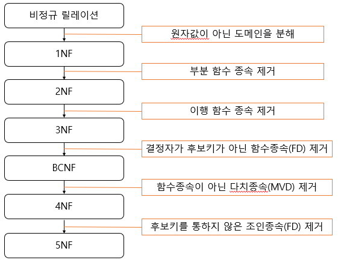
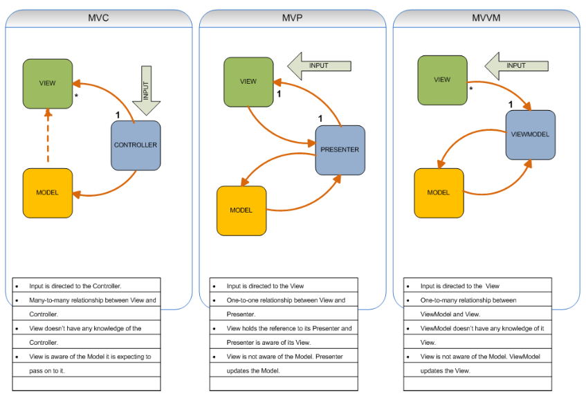

# 컴퓨터 CS 정리

## Python


## Java

### Garbage Collection

 프로그램이 동적으로 할당했던 메모리 영역 중에서 필요없게 된 영역을 해제하는 기능이다.

장점

- 프로그래머가 동적으로 할당한 메모리 영역의 전체를 완벽하게 관리할 필요가 없어진다.
- 유효하지 않은 포인터에 접근하지 않는다. 따라서 이중 해제 문제점도 없어진다.
- 더 이상 필요하지 않은 메모리가 해제되고 메모리 누수가 없어진다.

단점

- 어떤 메모리를 해제할지 결정하는 데 비용이 든다.
- 할당된 메모리가 해제되는 시점을 알 수 없다.


## OOP

### 객체지향프로그래밍

 객체지향 프로그래밍(Object-Oriented Programming)이란 문제를 여러 개의 객체 단위로 나눠 작업하는 방식을 말합니다. 클래스를 이용해 연관있는 데이터 부분(변수)과 처리 부분(함수)를 하나로 묶어 객체(인스턴스)를 생성해 사용한다는 점입니다.

장점

- 코드 재사용성이 용이
- 유지보수가 쉽다
- 대규모 프로젝트에 적합하다

단점

- 처리 속도가 느리다
- 객체에 따른 용량이 증가한다
- 설계에 시간이 많이 소요된다.


### 추상화(Abstraction)

 객체지향에서 추상화란 객체에서 공통된 속성과 행위를 추출하는 것을 의미한다.

 예를들어, 게임 프로그램을 개발하며 캐릭터가 소지하는 다양한 무기들이 있다. 칼, 삽, 곡갱이, 총, 활 등 여러가지 무기들이 존재하는데, 이들의 기능적인 내용은 다르지만 공통적인 속성과 행위를 개념으로 무기라는 클래스를 정의할 수 있다. 이렇듯 추상화는 다른 객체들과 구분되는 핵심적인 부분에 집중하여, 복잡도를 관리할 수 있게 해준다.


### 캡슐화(Encapsulation)

 캡슐화는 연관있는 변수와 메소드를 묶어주는 작업을 말한다.

 접근 제어 지시자[public, private, protected]를 통해 외부로부터의 접근을 제한하여 객체내에서만 접근이 가능하도록 해주며 이를 정보은닉이라 한다. 외부의 클래스 혹은 모듈에 의존적인 프로그램의 경우 변경이나 오류에 취약해지는데, 정보은닉을 통해 이러한 결합도를 낮추며 응집도를 높여준다.


### 상속(Inheritance)

 클래스 개념이 도입되면서 상속을 통해 부모클래스의 속성과 기능을 이어받아 사용하는 것을 말한다.

 프로그램을 개발하다보면 중복되는 속성과 기능을 개발해야하는 일이 발생되는데 상속을 사용한다면 중복되는 기능을 반복하여 작업하지 않고 작업을 할 수 있게 해준다. 자식클래스는 상속을 통해 부모클래스의 속성과 기능을 물려받는다.

 또한, 다형성을 통해 변경이 필요한 부분을 변경하여 사용할 수 있다.


### 다형성(Polymorphism)

 다형성이란 프로그래밍 언어의 자료형 체계의 성질을 나타내는 것으로, 동일한 변수, 함수명 등이 다양한 방법으로 기능하는 것을 말하며 오버라이딩(Overriding), 오버로딩(Overloading)이란 형태로 제공된다.


### 오버라이딩(Overriding), 오버로딩(Overloading)

 오버라이딩은 상위 클래스가 갖고 있는 메서드를 하위 클래스가 상속해 재정의해서 사용하는 것이다. 오버로딩은 메서드 오버로딩과 생성자 오버로딩이 있으며, 같은 이름의 함수를 여러개 정의하고, 매개변수의 유형과 개수를 다르게 하여 다양한 유형의 호출에 응답할 수 있게 하는 것이다. 


## OS

### 프로세스와 스레드

  프로세스는 운영체제로부터 자원을 할당받는 작업의 단위이고 스레드는 프로세스가 할당받은 자원을 이용하는 실행의 단위입니다. 프로세스는 실행될 때 운영체제로부터 프로세서, 필요한 주소 공간, 메모리 등 자원을 할당받습니다. 스레드란 한 프로세스 내에서 동작되는 여러 실행의 흐름으로 프로세스 내의 주소 공간이나 자원들을 같은 프로세스 내에 스레드끼리 공유하면서 실행됩니다.

 그렇다면 왜 멀티 프로세스로 할 수 있는 작업들을 굳이 하나의 프로세스에서 스레드로 나눠가면서 할까요? 이유는 간단합니다. 운영체제는 시스템 자원을 효율적으로 관리하기 위해서 스레드를 사용하는 것입니다. 

 자세히 말하면 멀티 프로세스로 실행되는 작업을 멀티 스레드로 실행할 경우, 프로세스를 생성하여 자원을 할당하는 시스템 콜이 줄어들어 자원을 효율적으로 관리할 수 있습니다. 뿐만 아니라 프로세스 간의 통신보다 스레드 간의 통신의 비용이 적으므로 작업들 간의 통신의 부담이 줄어들게 됩니다.

 이처럼 스레드를 활용하면 자원의 효율성이 증가하기도 하지만 스레드 간의 자원 공유는 전역 변수를 이용하므로 동기화 문제에 신경을 써야 합니다.


## 자료구조, 알고리즘

### Stack

자료의 입력과 출력을 한 방향으로 제한한 자료구조입니다. LIFO(Last In First Out). 함수의 콜스택에 쓰이고 문자열을 역순으로 출력할 때 연산자 후위표기법 등에 쓰입니다.

### Queue

 자료의 입력과 출력을 한 쪽 끝(front, rear)으로 제한한 자료구조입니다. FIFO(First In First Out). 컴퓨터 버퍼에서 주로 사용합니다(입력이 된 순서로 버퍼에 쌓아 대기 시키는 구조).

### Deque

 자료의 입력과 출력을 양쪽 끝 모두에서 가능하게 한 구조입니다.

### Tree

 트리는 컴퓨터의 디렉토리 구조 형태를 갖는 계층 모델로서 node와 node들을 연결하는 edge로 이루어져 있고, 하나의 루트 node를 갖습니다. 사이클이 존재하지 않으며 각 노드는 자식 노드를 가질 수 있습니다. 트리의 종류로는 이진 트리, 이진 탐색 트리, 균형 트리, max-heap, min-heap 등이 있습니다.

### Heap

 완전 이진 트리의 일종으로 우선순위 큐를 위하여 만들어진 자료구조입니다. 주로 여러 개의 값들 중에서 최댓값이나 최솟값을 빠르게 찾아내는 것을 목적으로 합니다. 최대힙은 부모 노드의 키 값이 자식 노드의 키 값보다 크거나 같은 완전 이진 트리. 최소힙은 부모 노드의 키 값이 자식 노드의 키 값보다 작거나 같은 완전 이진 트리입니다.

### 퀵 소트

### 병합정렬


## 데이터베이스

### DBMS(Database Management System)

 다수의 컴퓨터 사용자들이 컴퓨터에 수록된 수 많은 자료들을 쉽고 빠르게 추가, 수정, 삭제할 수 있도록 해주는 시스템이다. DB내의 정보를 검색하거나 정보를 저장하기 편리하고 효율적인 환경을 제공하는 것이 목적.

| 분류                                              | 개념                                                         | 예시                         |
| ------------------------------------------------- | ------------------------------------------------------------ | ---------------------------- |
| DDL (데이터 정의 언어, Data Definition Language)  | 데이터를 정의하기 위한 언어. 관계형 데이터베이스 구조(테이블, 스키마)를 정의하기 위한 명령어이다. | CREATE DROP ALTER            |
| DML(데이터 조작 언어, Data Manipulation Language) | 데이터를 저장, 수정, 삭제, 조회 등을 하기 위한 언어이다.     | INSERT UPDATE DELETE SELECT  |
| DCL(데이터 제어 언어, Data Control Language)      | 데이터베이스 사용자의 권한 제어를 위해 사용되는 언어이다.    | GRANT REVOKE COMMIT ROLLBACK |


### JOIN

> 테이블 예시(A 테이블, B 테이블)

```
A 테이블	B 테이블
과일		과일
---		 ---
사과		멜론
수박		참외
멜론		딸기
참외		자두
```

> Inner join

두 테이블의 교집합을 얻습니다. 

```
SELECT * FROM A INNER JOIN B ON A.과일 = B.과일;

(결과)
A | B
--+--
멜론 | 멜론
참외 | 참외
```

> Left outer join

Left outer join은 A에 있는 모든 행과 B에 함께 있는 행을 얻습니다.

```
SELECT * FROM A LEFT OUTER JOIN B ON A.과일 = B.과일;

(결과)
A | B
--+--
사과 | null
수박 | null
멜론 | 멜론
참외 | 참외
```

> Full outer join

Full outer join은 A와 B의 합집합을 얻습니다. 만약 어떤 행의 A에는 데이터가 있고, B에는 비어있는 경우 B 부분은 null이며, 반대의 경우에는 A 부분이 null입니다.

```
SELECT * FROM A FULL OUTER JOIN B ON A.과일 = B.과일;

(결과)
A | B
--+--
사과 | null
수박 | null
멜론 | 멜론
참외 | 참외
null | 딸기
null | 자두
```


### ORM(Object Relational Mapping)

 객체와 관계형 데이터베이스의 데이터를 자동으로 매핑해주는 것을 말한다. 객체지향프로그래밍은 클래스를 사용하고, 관계형 데이터베이스는 테이블을 사용한다. 객체 모델과 관계형 모델 간에 불일치가 존재하는데 ORM을 통해 객체 관의 관계를 바탕으로 SQL을 자동으로 생성하여 불일치를 해결한다.


### 트랜잭션

 트랜잭션(Transaction)은 데이터베이스의 상태를 변환시키는 하나의 논리적 기능을 수행하기 위한 작업의 단위 또는 한꺼번에 모두 수행되어야 할 일련의 연산들을 의미한다.

>  트랜잭션의 성질

ACID(Atomicity, Consistency, Isolation, Durability)

> 트랜잭션 연산

Commit 연산: 한개의 논리적 단위(트랜잭션)에 대한 작업이 성공적으로 끝났고 데이터베이스가 다시 일관된 상태에 있을 때, 이 트랜잭션이 행한 갱신 연산이 완료된 것을 트랜잭션 관리자에게 알려주는 연산이다.

Rollback 연산: 하나의 트랜잭션 처리가 비정상적으로 종료되어 데이터베이스의 일관성을 깨뜨렸을 때, 이 트랜잭션의 일부가 정상적으로 처리되었더라도 트랜잭션의 원자성을 구현하기 위해 이 트랜잭션이 행한 모든 연산을 취소(Undo)하는 연산이다. Rollback 시에는 해당 트랜잭션을 재시작하거나 폐기한다.

> 트랜잭션의 상태

활동(Active) : 트랜잭션이 실행중인 상태

실패(Failed) : 트랜잭션 실행에 오류가 발생하여 중단된 상태

철회(Aborted) : 트랜잭션이 비정상적으로 종료되어 Rollback 연산을 수행한 상태

부분 완료(Partially Committed) : 트랜잭션의 마지막 연산까지 실행했지만, Commit 연산이 실행되기 직전의 상태

완료(Committed) : 트랜잭션이 성공적으로 종료되어 Commit 연산을 실행한 후의 상태


### ACID

Atomicity: 원자성. 완료되지 않은 트랜잭션의 중간 상태를 데이터베이스에 반영하면 안된다.

Consistency: 일관성. 고립된 트랜잭션의 수행이 데이터베이스의 일관성을 보존해야 한다.

Isolation: 고립성. 여러 트랜잭션이 동시에 수행되더라도 각각의 트랜잭션은 다른 트랜잭션의 수행에 영향을 받지 않고 독립적으로 수행되어야 한다.

Durability: 지속성. 트랜잭션이 성공적으로 완료되어 커밋되고 나면 해당 트랜잭션에 의한 모든 변경은 향후에 어떤 소프트웨어나 하드웨어 장애가 발생되더라도 보존되어야 한다.


### 무결성(Integrity)

 데이터의 무결성은 데이터의 정확성, 일관성, 유효성이 유지되는 것을 말한다. 데이터의 무결성을 유지하는 것은 데이터베이스 관리시스템 (DBMS)의 중요한 기능이며, 주로 데이터에 적용되는 연산에 제한을 두어 데이터의 무결성을 유지한다. 데이터베이스에서 말하는 무결성에는 다음과 같은 4가지 종류가 있다.

1. 개체 무결성(Entity Integrity)

모든 테이블이 기본 키 (primary key)로 선택된 필드 (column)를 가져야 한다. 기본 키로 선택된 필드는 고유한 값을 가져야 하며, 빈 값은 허용하지 않는다.

2. 참조 무결성(Referential Integrity)

 관계형 데이터베이스 모델에서 참조 무결성은 참조 관계에 있는 두 테이블의 데이터가 항상 일관된 값을 갖도록 유지되는 것을 말한다. 예를 들어 student 테이블이 department 테이블을 참조하고 있다고 가정하자. 만약 department 테이블에서 id 값이 310인 레코드가 삭제되면 이를 참고하는 student 테이블의 레코드는 더 이상 존재하지 않는 데이터를 참조하게 돼 참조 무결성이 깨지게 된다.

3. 도메인 무결성(Domain Integrity)

 도메인 무결성은 테이블에 존재하는 필드의 무결성을 보장하기 위한 것으로 필드의 타입, NULL값의 허용 등에 대한 사항을 정의하고, 올바른 데이터의 입력 되었는지를 확인하는 것이다. 예를 들어, 주민등록번호 필드에 알파벳이 입력되는 경우는 도메인 무결성이 깨지는 경우라고 볼 수 있다. DBMS의 기본값 설정, NOT NULL 옵션 등의 제약 사항으로 도메인 무결성을 보장할 수 있다.

4. 무결성 규칙(Integrity rule)

 데이터베이스에서 무결성 규칙은 데이터의 무결성을 지키기 위한 모든 제약 사항들을 말한다. 비즈니스 규칙 (business rule)은 데이터베이스를 이용하는 각각의 유저에 따라 서로 다르게 적용되지만, 무결성 규칙은 데이터베이스 전체에 공통적으로 적용되는 규칙이다.


### 정규화

 자료의 손실이나 불필요한 정보의 도입 없이 데이터의 일관성, 데이터 중복을 최소화하고 최대의 데이터 안정성 확보를 위한 안정적 자료 구조로 변환하기 위해서 하나의 테이블을 둘 이상을 분리하는 작업이다.

정규화의 목적은

- 저장 공간 최소화
- 데이터 무결성 유지
- 자료구조의 안정성 최대화

이다.

어느 테이블이든 어느 정도는 정규화 될 수 있는데 데이터베이스 이론에서 테이블의 정규화된 정도를 정규형이라는 용어를 써서 표현한다.




### 뷰(View)

 뷰는 사용자에게 접근이 허용된 자료만을 제한적으로 보여주기 위해 하나 이상의 기본 테이블로부터 유도된, 이름을 가지는 가상테이블이다. 뷰는 저장장치 내에 물리적으로 존재하지 않지만 사용자에게 있는 것처럼 간주되며 데이터 보정작업, 처리과정 시험 등 임시적인 작업을 위한 용도로 활용된다.

뷰는 기본테이블로부터 유도된 테이블이기 때문에 기본 테이블과 같은 형태의 구조를 사용하며, 조작도 기본 테이블과 거의 같다. 뷰는 가상 테이블이기 때문에 물리적으로 구현돼 있지는 않다.

> 뷰 생성 예시

```sql
--고객 테이블에서 주소가 서울시인 고객들의 성명과 전화번호를 서울고객이라는 뷰로 만들어라--
CREATE VIEW 서울고객(성명, 전화번호)
AS SELECT 성명 전화번호
FROM 고객
WHERE 주소 = '서울시';
```


### NoSQL

 Not Only SQL. RDBMS의 형태가 아닌 일관성 모델(비관계형 모델, Non-relational)을 이용하는 데이터베이스 형태. 복잡한 테이블들 간의 관계(relation)가 없으므로 고정된 형태의 스키마가 존재하지 않는다. 최적화된 Key-value 형식의 저장 공간의 사용한다.

NoSQL은 분산 환경에서 대용량의 데이터를 빠르게 처리하기 위해서 개발되었으며, 장점으로서 수평적 확장성(Horizontal Scalability)을 가져 데이터 추가가 용이하며 단점으로는 RDBMS와 달리 중복된 데이터를 다량 가지고 있을 수 있다는 점이다.

> RDBMS와 다른 점

- 스키마가 없다. 즉 데이터 관계와 정해진 규격(table-column의 정의)이 없다.
- 관계 정의가 없으니 Join이 불가능하다. (하지만 reference와 같은 기능으로 비슷하게 구현은 가능.)
- 트랜잭션을 지원하지 않는다.
- 분산처리(수평적 확장)의 기능을 쉽게 제공한다.
- 대부분의 NoSQL DB는 분산처리기능을 목적으로 나왔기 때문에 분산처리 기능을 자체 프레임워크에 포함하고 있다.


### Index

 DB에서 Index란 테이블에 저장된 데이터를 빠르게 조회하기 위한 데이터베이스 객체입니다. B-Tree 구조를 가지며 논리적, 물리적으로 테이블과는 독립적입니다. 

 Index를 사용하는 이유는

- 인덱스(Index)는 데이터를 논리적으로 정렬하여 검색과 정렬 작업의 속도를 높이기 위해 사용된다.
- 예를 들면, 책에서 가장 빨리 내용을 찾는 방법은 책의 뒤편의 색인을 보는 것.
- 기본키에 대해서는 항상 DBMS가 내부적으로 정렬된 목록을 관리하기에 특정 행을 가져올 때 빠르게 처리된다. 하지만, 다른 열의 내용을 검색하거나 정렬시에는 하나하나 대조를 해보기 때문에 시간이 오래걸린다. (이를 인덱스로 정의해두면 검색속도가 향상된다.)
- 단점: 인덱스를 사용하면 데이터를 가져오는 작업의 성능은 향상시킬 수 있지만 데이터 삽입, 변경 등이 일어날 때 매번 인덱스가 변경되기 때문에 성능이 떨어질 수 있다.
- 사용대상 : 데이터 필터링과 정렬에 사용되므로, 데이터를 특정한 순서로 자주 정렬한다면 인덱스를 사용하기에 적합


### Elasticsearch

 Elasticsearch는 텍스트, 숫자, 위치 기반 정보, 정형 및 비정형 데이터 등 모든 유형의 데이터를 위한 분산형 오픈 소스 검색 및 분석 엔진입니다.  

Elastcisearch의 속도와 확장성 그리고 수많은 종류의 콘텐츠를 Indexing할 수 있는 능력은 어플리케이션 검색, 웹사이트 검색, 로깅과 로그 분석, 모니터링, 데이터 분석 등에 사용할 수 있습니다.

Elasticsearch Index는 서로 관련되어 있는 문서들의 모음입니다. Elasticsearch는 JSON 문서로 데이터를 저장합니다. 각 문서는 일련의 키(필드나 속성의 이름)와 그에 해당하는 값(문자열, 숫자, 부울, 날짜, 값의 배열, 지리적 위치 또는 기타 데이터 유형)을 서로 연결합니다.

Elasticsearch는 반전된 Index라고 하는 데이터 구조를 사용하는데, 이것은 아주 빠른 전체 텍스트 검색을 할 수 있도록 설계된 것입니다. 반전된 Index는 문서에 나타나는 모든 고유한 단어의 목록을 만들고, 각 단어가 발생하는 모든 문서를 식별합니다.

Index 프로세스 중에, Elasticsearch는 문서를 저장하고 반전된 Index를 구축하여 거의 실시간으로 문서를 검색 가능한 데이터로 만듭니다. Index API를 사용해 색인이 시작되며, 이를 통해 사용자는 특정한 Index에서 JSON 문서를 추가하거나 업데이트할 수 있습니다.


## 네트워크

### 패킷(packet)

 네트워크 통신을 할 때 사용되는 작게 분할된 데이터 조각으로 네트워크에서 전송하는 데이터의 기본 단위이다.


### 인터넷 서비스 제공자(ISP, Internet Service Provider)

 인터넷에 접속하는 수단을 제공하는 주체다. 일반 사용자, 기업체, 기관, 단체 등이 인터넷에 접속하여 인터넷을 이용할 수 있도록 돕는 사업자다(KT, U+, SK브로드밴드 등).


### URI vs URL

 URI(Uniform Resource Identifier, 통합 자원 식별자), URL(Uniform Resource Locator, 통합 자원 위치)은 모두 인터넷 상에서 존재하는 어떤 자원(웹 문서, 이미지, pdf 파일 등)의 위치를 나타내는 주소이지만 URI가 URL을 포함하는 더 넓은 개념입니다.

```
1. http://www.test.com/index.html  -------------|
URI: O, URL: O									|
												|
												|----------- index.html
												|
												|
2. http://www.test.com/index -------- rewrite --|
URI: O, URL: X
```

두 주소 모두 index.html을 가리키고 있습니다.

1은 웹 서버의 실제 파일의 위치를 나타내는 주소 즉, URL이면서 URI입니다.

2는 웹서버에 실제로 index라는 파일은 존재하지 않기 때문에 URL은 아닙니다. 하지만 rewrite(rewrite를 통해 실제 웹 페이지의 파일 이름을 숨기는 경우가 많습니다)를 통해 index.html을 가리키고 있기 때문에 URI라고 볼 수 있습니다. (예시 : https://section.blog.naver.com/BlogHome.nhn에서 BlogHome.nhn이라는 파일은 실제로 네이버 서버에 존재하지 않을 것입니다. 그러미로 이는 URI입니다.)


### 프로토콜

 컴퓨터 간에 정보를 주고받을 때의 통신 방법에 대한 규칙이나 표준.


### OSI 7 Layer 모델

 국제표준화기구(ISO)가 1977년에 정의한 국제 통신 표준 규약이다. 네트워크의 기본 구조를 7개 계층으로 나눠서 표준화한 통신 규약으로 현재 다른 모든 통신 규약의 기반이 된다.

`응, 표, 세, 전, 네, 데, 물`

| 계층  | 이름                              | 설명                                                         |
| ----- | --------------------------------- | ------------------------------------------------------------ |
| 7계층 | 응용 계층(Application Layer)      | 사용자가 네트워크에 접근할 수 있도록 서비스를 제공한다.      |
| 6계층 | 표현 계층(Presentation Layer)     | 세션 계층 간의 주고받는 인터페이스를 일관성 있게 제공한다.   |
| 5계층 | 세션 계층(Session Layer)          | 통신 시스템 사용자간의 연결을 유지 및 설정한다.              |
| 4계층 | 전송 계층(Transport Layer)        | 두 호스트 시스템으로부터 발생하는 데이터의 흐름을 제공한다.  |
| 3계층 | 네트워크 계층(Network Layer)      | 패킷을 네트워크 간의 IP를 통하여 데이터를 전달, 장비로는 라우팅이 존재한다. |
| 2계층 | 데이터 링크 계층(Data Link Layer) | 송/수신을 확인. MAC Address를 가지고 통신. 장비로는 브릿지와 스위치가 존재한다. |
| 1계층 | 물리 계층(Physical Layer)         | 시스템 간의 물리적인 연결과 전기 신호를 변환 및 제어한다.    |


###  TCP/IP(Internet Protocol Suite)

 OSI 모델 7계층의 네트워크에서 데이터를 전송하는 과정을 4개 계층으로 단순화시켜 사용하는 모델이다. 인터넷 모델이라고도 한다.

| 계층                 | 설명                                                         |
| -------------------- | ------------------------------------------------------------ |
| 응용 계층            | OSI 7계층의 세션 계층, 표현 계층, 응용 계층에 해당한다. TCP/UDP 기반의 응용 프로그램을 구현할 때 사용한다. 프로토콜 - FTP, HTTP, SSH |
| 전송 계층            | OSI 7 계층의 전송 계층에 해당한다. 통신 노드간의 연결을 제어하고 신뢰성있는 데이터 전송을 담당한다. 프로토콜 - TCP, UDP |
| 인터넷 계층          | OSI 7계층의 네트워크 계층에 해당한다. 통신 노드 간의 IP패킷을 전송하는 기능과 라우팅 기능을 담당한다. 프로토콜 – IP, ARP, RARP |
| 네트워크 엑세스 계층 | OSI 7계층의 물리계층과 데이터 링크 계층에 해당한다. 물리적인 주소로 MAC을 사용한다. LAN, 패킷망, 등에 사용된다. |


### TCP(Transmission Control Protocol)

 연결형 서비스를 지원하는 전송 계층 프로토콜. 인터넷 환경에서 기본으로 사용한다. 호스트간 신뢰성 있는 데이터 전달과 흐름제어 및 혼잡제어 등을 제공하는 전송 계층이다.

> 특징

-  가상 회선 연결 방식.
- 높은 신뢰성
- 연결의 설정(3-way handshaking)과 해제(4-way handshaking)
- 데이터 흐름 제어(수신자 버퍼 오버플로우 방지) 및 혼잡 제어(네트워크 내 패킷 수가 과도하게 증가하는 현상 방지)
- 전이중(Full-Duplex), 점대점(Point to Point) 서비스

> 소켓 통신 과정

- 서버: 소켓을 생성, 주소 할당, 연결 요청 기다림, 요청에 대한 응답
- 클라이언트: 소켓을 생성, 주소 할당, 연결 요청


### UDP(User Datagram Protocol)

 비연결형 서비스를 지원하는 전송 계층 프로토콜. 인터넷상에서 서로 정보를 주고받을 때 정보를 보낸다는 신호나 받는다는 신호 절차를 거치지 않고, 보내는 쪽에서 일방적으로 데이터를 전달하는 통신 프로토콜. 보내는 쪽에서는 받는 쪽이 데이터를 받았는지 아닌지 확인하지 않는다.

> 특징

- 비연결형(Port만 확인하여 소켓을 식별하고 송수신한다)
- 패킷 오버헤드가 적어 네트워크 부하 감소
- 비신뢰성
- TCP의 Handshaking 같은 연결 성정이 없음

> 소켓 통신 과정

- 서버: 소켓을 생성, 주소 할당, 데이터를 송수신
- 클라이언트: 소켓 생성 후 데이터 수신

|             | TCP                                                          | UDP                                                          |
| ----------- | ------------------------------------------------------------ | ------------------------------------------------------------ |
| 연결 방식   | 연결형 프로토콜<br />연결 후 통신<br />1:1 통신 방식         | 비연결형 프로토콜<br />연결없이 통신<br />1:1, 1:N, N:N 통신 방식 |
| 특징        | - 데이터의 경계를 구분 안함<br />- 신뢰성 있는 데이터 전송<br />- 데이터의 전송 순서 보장<br />- 데이터의 수신 여부 확인<br />- 패킷을 관리할 필요 없음<br />- UPD보다 전송 속도가 느림 | - 데이터의 경계를 구분 함<br />- 신뢰성 없는 데이터 전송<br />- 데이터의 전송 순서가 바뀔 수 있음<br />- 데이터의 수신 여부를 확인 안함<br />- 패킷을 관리해야 함<br />- TCP보다 전송 속도가 빠름 |
| 관련 클래스 | .Socker<br />.ServerSocket                                   | .DatagramSocker<br />.DatagramPacket<br />.MulticastSocket   |


### 캡슐화/역캡슐화(encapsulation/ decapsulation)

 캡슐화는 컴퓨터 통신에서 상위 계층의 통신 프로토콜 정보를 데이터에 추가하여 하위 계층으로 전송하는 기술이다. 반대로 역캡슐화는 상위 계층의 통신 프로토콜에서 하위 계층에서 추가한 정보와 데이터를 분리하는 기술이다.


### 헤더(Header)

 저장되거나 전송되는 데이터의 맨 앞에 위치하는 추가적인 정보 데이터다. 데이터의 내용이나 성격을 식별 또는 제어하는 데 사용한다.


### API(Application Programming Interface)

  API는 응용 프로그램(본인이 제작하는 프로그램)에서 사용할 수 있도록, 운영체제나 프로그래밍 언어가 제공하는 기능(카카오 지도 API, 페이스북 소셜로그인 API)을 제어할 수 있게 만든 인터페이스를 말한다. 어떤 특정 사이트에서 특정 데이터를 공유할 경우 어떠한 방식으로 정보를 요청해야하는지 그리고 어떠한 데이터를 제공 받을 수 있을지에 대한 규격들을 뜻한다.


### 동기(synchronous)와 비동기(asynchronous)

 동기는 말 그대로 동시에 일어난다는 말이다. 요청과 그 결과가 동시에 일어난다는 약속이다. 바로 요청을 하면 시간이 얼마나 걸리든 요청한 자리에서 결과가 주어져야 한다(트랜잭션이 일치). 설계가 간단하고 직관적이지만, 결과가 주어질 때까지 대기해야한다.

 비동기는 동시에 일어나지 않는다는 말이다. 요청과 동시에 결과가 주어지지 않는다(트랜잭션이 불일치). 설계가 복잡하지만 결과가 주어지는데 시간이 걸리더라도 그 시간 동안 다른 작업을 할 수 있으므로 자원을 효율적으로 관리할 수 있다.


### Preflight Request

 Preflight Request는 actual 요청 전에 인증 헤더를 전송하여 서버의 허용 여부를 미리 체크하는 테스트 요청이다.


### 쿠키와 세션

> HTTP의 특징과 쿠키와 세션을 사용하는 이유

- HTTP 프로토콜의 특징이자 약점을 보완하기 위해서 사용한다.
- HTTP 프로토콜 환경에서 서버는 클라이언트가 누구인지 확인해야합니다. 그 이유는 HTTP 프로토콜이 connectionless(클라이언트가 요청을 한 후 응답을 받으면 그 연결을 끊어 버리는 특징), stateless(통신이 끝나면 상태를 유지하지 않는 특징)한 특성이 있기 때문입니다.

쿠키와 세션은 위의 두 가지 특징을 해결하기 위해 사용합니다.

예를 들어, 쿠키와 세션을 사용하지 않으면 쇼핑몰에서 옷을 구매하려고 로그인을 했음에도, 페이지를 이동할 때 마다 계속 로그인을 해야 합니다. 쿠키와 세션을 사용했을 경우, 한 번 로그인을 하면 어떠한 방식에 의해서 그 사용자에 대한 인증을 유지하게 됩니다.

> 쿠키

쿠키는 클라이언트(브라우저) 로컬에 저장되는 키와 값이 들어있는 작은 데이터 파일입니다.

사용자 인증이 유효한 시간을 명시할 수 있으며, 유효 시간이 정해지면 브라우저가 종료되어도 인증이 유지된다는 특징이 있습니다. 쿠키는 클라이언트의 상태 정보를 로컬에 저장했다가 참조합니다.

> 쿠키의 동작 방식

1. 클라이언트가 페이지를 요청
2. 서버에서 쿠키를 생성
3. HTTP 헤더에 쿠키를 포함 시켜 응답
4. 브라우저가 종료되어도 쿠키 만료 기간이 있다면 클라이언트에서 보관하고 있음
5. 같은 요청을 할 경우 HTTP 헤더에 쿠키를 함께 보냄
6. 서버에서 쿠키를 읽어 이전 상태 정보를 변경 할 필요가 있을 때 쿠키를 업데이트 하여 변경된 쿠키를 HTTP 헤더에 포함시켜 응답

> 쿠키의 사용 예

- 방문 사이트에서 로그인 시, "아이디와 비밀번호를 저장하시겠습니까?"
- 쇼핑몰의 장바구니 기능
- 자동로그인, 팝업에서 "오늘 더 이상 이 창을 보지 않음" 체크, 쇼핑몰의 장바구니

>  세션이란?

- 세션은 쿠키를 기반하고 있지만, 사용자 정보 파일을 브라우저에 저장하는 쿠키와 달리 세션은 서버 측에서 관리합니다.
- 서버에서는 클라이언트를 구분하기 위해 세션 ID를 부여하며 웹 브라우저가 서버에 접속해서 브라우저를 종료할 때까지 인증상태를 유지합니다.
- 물론 접속 시간에 제한을 두어 일정 시간 응답이 없다면 정보가 유지되지 않게 설정이 가능 합니다.
- 사용자에 대한 정보를 서버에 두기 때문에 쿠키보다 보안에 좋지만, 사용자가 많아질수록 서버 메모리를 많이 차지하게 됩니다.
- 즉 동접자 수가 많은 웹 사이트인 경우 서버에 과부하를 주게 되므로 성능 저하의 요인이 됩니다.
- 클라이언트가 Request를 보내면, 해당 서버의 엔진이 클라이언트에게 유일한 ID를 부여하는 데 이것이 세션ID다.

>  세션의 동작 방식

1. 클라이언트가 서버에 접속 시 세션 ID를 발급받습니다.
2. 클라이언트는 세션 ID에 대해 쿠키를 사용해서 저장하고 가지고 있습니다.
3. 클라리언트는 서버에 요청할 때, 이 쿠키의 세션 ID를 서버에 전달해서 사용합니다.
4. 서버는 세션 ID를 전달 받아서 별다른 작업없이 세션 ID로 세션에 있는 클라언트 정보를 가져옵니다.
5. 클라이언트 정보를 가지고 서버 요청을 처리하여 클라이언트에게 응답합니다.

>  세션의 특징

- 각 클라이언트에게 고유 ID를 부여
- 세션 ID로 클라이언트를 구분해서 클라이언트의 요구에 맞는 서비스를 제공
- 보안 면에서 쿠키보다 우수
- 사용자가 많아질수록 서버 메모리를 많이 차지하게 됨

> 세션의 사용 예

- 로그인 같이 보안상 중요한 작업을 수행할 때 사용

>  쿠키와 세션의 차이

- 쿠키와 세션은 비슷한 역할을 하며, 동작원리도 비슷합니다. 그 이유는 세션도 결국 쿠키를 사용하기 때문입니다.
- 가장 큰 차이점은 사용자의 정보가 저장되는 위치입니다. 때문에 쿠키는 서버의 자원을 전혀 사용하지 않으며, 세션은 서버의 자원을 사용합니다.
- 보안 면에서 세션이 더 우수하며, 요청 속도는 쿠키가 세션보다 더 빠릅니다. 그 이유는 세션은 서버의 처리가 필요하기 때문입니다.
- 보안, 쿠키는 클라이언트 로컬에 저장되기 때문에 변질되거나 request에서 스니핑 당할 우려가 있어서 보안에 취약하지만 세션은 쿠키를 이용해서 sessionid 만 저장하고 그것으로 구분해서 서버에서 처리하기 때문에 비교적 보안성이 좋습니다.
- 라이프 사이클, 쿠키도 만료시간이 있지만 파일로 저장되기 때문에 브라우저를 종료해도 계속해서 정보가 남아 있을 수 있다. 또한 만료기간을 넉넉하게 잡아두면 쿠키삭제를 할 때 까지 유지될 수도 있다.
- 반면에 세션도 만료시간을 정할 수 있지만 브라우저가 종료되면 만료시간에 상관없이 삭제된다.
- 속도, 쿠키에 정보가 있기 때문에 서버에 요청시 속도가 빠르고 세션은 정보가 서버에 있기 때문에 처리가 요구되어 비교적 느린 속도를 낸다.

출처: https://interconnection.tistory.com/74 [라이언 서버]


### JWT(JSON Web Token)

 JWT란 JSON 포맷을 이용하여 사용자에 대한 속성을 저장하는 Claim 기반의 Web Token이다. JWT는 토큰 자체를 정보로 사용하는 Self-Contained 방식으로 정보를 안전하게 전달한다. 주로 회원 인증이나 정보 전달에 사용되는 JWT는 아래 로직으로 처리된다.

1. 어플리케이션이 실행될 때 JWT를 static 변수와 로컬 스토리지에 저장한다. static 변수에 저장되는 이유는 HTTP 통신을 할 때 마다 JWT를 HTTP 헤더에 담아서 보내야 하는데, 이를 로컬 스토리지에서 계속 불러오면 오버헤드가 발생하기 때문이다.
2. JWT를 포함해 요청을 보내면 서버는 허가된 JWT인지 검사한다.
3. 로그아웃을 할 경우 로컬 스토리지에 저장된 JWT를 제거한다. (실제 서비스의 경우에는 사용했던 토큰을 blacklist라는 DB 테이블에 넣어 해당 토큰의 접근을 막는 작업을 해주어야 한다)

JWT는 Header, Payload, Signature의 3부분으로 이루어진다.

- Header: 헤더는 typ와 alg 두 가지 정보로 구성된다.
  - typ: 토큰의 타입을 지정
  - alg: 알고리즘 방식을 지정
- Payload: 토큰에서 사용할 정보의 조각들인 클레임(Claim)이 담겨 있다. BASE64로 인코딩.
- Signature: Signature는 토큰을 인코딩하거나 유효성 검증을 할 때 사용하는 고유한 암호화 코드이다.

> 장점

1. 사용자 인증에 필요한 모든 정보는 토큰 자체에 포함하기 때문에 별도의 인증 저장소가 필요없다.

> 단점

1. Self-contained: 토큰 자체에 정보를 담고 있으므로 보안에 취약할 수 있다.
2. 토큰 길이: 3종류의 클레임을 저장하기 때문에 정보가 많아질수록 길이가 늘어나 네트워크에 부하를 줄 수 있다.
3. Payload 인코딩: Payload 자체가 암호화된 것이 아니라 BASE64로 인코딩된 것이므로 Payload를 탈취하여 디코딩하면 데이터를 볼 수 있다.


### CORS

 CORS(Cross-origin Resource Sharing)은 추가적인 HTTP Header를 사용해서 어플리케이션이 다른 origin의 리소스에 접근할 수 있도록 하는 메커니즘을 말합니다. 하지만 다른 origin에서 내 리소스에 함부로 접근하지 못하게 하기 위해 사용된다.

>  요청 헤더 목록

- Origin
- Access-Control-Request-Method: `preflight`요청을 할 때 실제 요청에서 어떤 메서드를 사용할 것인지 서버에게 알리기 위해 사용
- Access-Control-Request-Headers: `preflight` 요청을 할 때 실제 요청에서 어떤 header를 사용할 것인지 서버에게 알리기 위해 사용

> 응답 헤더 목록

- Access-Control-Allow-Origin: 브라우저가 해당 origin이 자원에 접근할 수 있도록 허용합니다. 혹은 *은 credentials이 없는 요청에 한해서 모든 origin에서 접근이 가능하도록 허용합니다.

> 필요한 이유

 내가 서비스하고 있지 않은 사이트에서 세션을 요청해서 세션을 획득할 수 있다면 해당 사이트는 악의적으로 내 세션을 탈취하거나 다른 행동을 할 수 있습니다. 그래서 브라우저에서는 이러한 요청을 막습니다. 내가 허용한 origin들만 요청할 수 있도록 하기 위해 필요합니다.

> CORS 작동 방식

 브라우저가 리소스를 요청할 때 추가적인 헤더에 정보를 담습니다. 내 origin은 무엇이고 어떤 메소드를 사용해서 요청을 할 것이고 어떤 헤더들을 포함할 것인지를 담아서 서버에 전송합니다. 서버는 서버가 응답할 수 있는 origin들을 헤더에 담아서 브라우저에게 보냅니다. 브라우저가 이 헤더를 보고 해당 origin에서 요청할 수 있다면 리소스 전송을 허용하고 만약 불가능하다면 에러를 발생시킵니다.


### 3-way Handshake & 4-way Handshake

 3-way Handshake는 TCP/IP 프로토콜을 이용해서 통신을 하는 응용프로그램이 데이터를 전송하기 전에 먼저 정확한 전송을 보장하기 위해 상대방 컴퓨터와 사전에 세션을 수립하는 과정을 의미한다.

1. A 클라이언트는 B 서버에 접속을 요청하는 SYN 패킷을 보낸다. 이때 A 클라이언트는 SYN을 보내고 SYN/ACK 응답을 기다리는 SYN_SENT 상태가 된다.
2. B 서버는 SYN 요청을 받고 A 클라이언트에게 요청을 수락한다는 ACK와 SYN flag가 설정된 패킷을 발송하고 A가 다시 ACK으로 응답하기를 기다린다. 이때 B 서버는 SYN_RECEIVED 상태가 된다.
3. A 클라이언트는 B서버에게 ACK을 보내고 이후 연결이 이루어지고 데이터가 오간다. 이때의 B 서버의 상태는 ESTABLISHED이다.

 4-way Handshake는 세션을 종료하기 위해 수행되는 절차이다.

1. 클라이언트가 연결을 종료하겠다는 FIN 플래그를 전송한다.
2. 서버는 확인 메세지를 보내고 자신의 통신이 끝날 때 까지 기다리는 TIME_WAIT 상태를 갖는다.
3. 서버가 통신이 끝났으면 연결이 종료되었다고 클라이언트에게 FIN 플래그를 전송한다.
4. 클라이언트는 확인했다는 메세지를 보낸다.


## 디자인, 설계



### MVC(Model-View-Controller)

 모든 입력은 Controller에서 처리된다. 입력이 Controller로 들어오면 Controller는 입력에 해당하는 Model을 조작하고,  Model을 나타낼 View를 선택한다. 

Controller는 View를 선택할 수 있기 때문에 하나의 Controller가 여러 개의 View를 선택하여 Model을 나타내어 줄 수 있다. 

이 때 Controller는 View를 선택만하고 업데이트를 시켜주지 않기 때문에 View는 Model을 이용하여 업데이트 하게 된다. 

Model을 직접 사용하거나 Model에서 View에게 Notify해 주는 방법, View에서 Polling을 통해 Model의 변화를 알아내는 방법 등이 있다. 

이와 같이 View는 Model을 이용하기 때문에 서로 간의 의존성을 완벽히 피할 수 없다는 단점이 있고, 좋은 MVC 패턴이라 함은 View와 Model 간의 의존성을 최대한 낮게한 패턴이 좋은 패턴이라 할 수 있다.


### MVP(Model-View-Presenter)

 MVC 패턴과 다르게 입력이 View에서 처리된다. Presenter는 View의 인스턴스를 갖고 있으며 View와 1대1 관계이고, 그에 해당하는 Model의 인스턴스 또한 갖고 있기때문에 View와 Model 사이에서 다리와 같은 역할을 한다. 

View에서 이벤트가 발생하면 Presenter에게 전달해주고 Presenter는 해당 이벤트에 따른 Model을 조작하고 그 결과를 바인딩을 통해 View에게 통보를 하여 View를 업데이트 시켜준다. 

MVC 패턴과는 다르게 Presenter를 통해 Model과 View를 완벽히 분리해 주기 때문에 View는 Model을 따로 알고 있지 않아도 된다는 장점이 있다. 단점으로는 View와 1대1 관계이기 때문에 View와의 의존성이 매우 강하다.


### MVVM(Model-View-ViewModel)

 ViewModel은 말그대로 View를 나타내주기 위한 Model이라고 생각하면 된다. View보다는 Model과 유사하게 디자인 되며, View의 바인딩 될 때 가장 강력하다. 

MVP와 같이 View에서 입력이 처리된다.

MVVM 패턴의 가장 큰 장점이라 함은 Command와 Data Binding으로 MVP 패턴과 달리 View와의 의존성을 완벽히 분리할 수 있다는 장점이 있다.

Command를 통하여 Behavior를 View의 특정한 ViewAction(Event)와 연결할 수 있으며, ViewModel의 속성과 특정 View의 속성을 Binding 시켜 줌으로써 ViewModel 속성이 변경 될때마다 View를 업데이트 시켜줄 수 있다.

