# flexbox

## 1. 개념

flexbox는 2가지만 기억하면 쉽게 이해할 수 있다.

1. 먼저 container가 있고, container 내부에 item들이 있다고 한다면, container에 적용되는 속성 값, item에 적용되는 속성 값들이 각각 존재한다.

>  container

- display
- flex-direction
- flex-wrap
- flex-flow
- justify-content
- align-items
- align-content


>  item

- order
- flex-grow
- flex-shrink
- flex
- align-self


2. flexbox에는 중심축(main axis)와 반대축(cross axis)이 있다. item이 수평 방향으로 정렬돼 있다면 중심축은 수평 방향, 반대축은 수직 방향이다.


## 2. container 속성

먼저, 해당 태그를 flexbox로 활용하기 위해서는 `display: flex`를 작성한다.

1. flex-direction (기본 값: row) - item들의 방향을 지정

   `row`: 왼쪽에서 오른쪽으로 가는 수평 방향

   ```css
   .container {
     background: beige;
     height: 100vh;
     display: flex;
     flex-direction: row;
   }
   ```

   

   `row-reverse`: 오른쪽에서 왼쪽으로 가는 수평 방향

   ```css
   .container {
     background: beige;
     height: 100vh;
     display: flex;
     flex-direction: row-reverse;
   }
   ```

   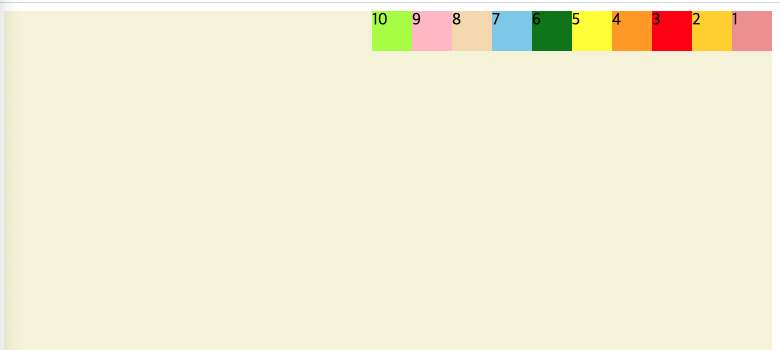

   `column`: 위에서 아래로 가는 수직 방향

   ```CSS
   .container {
     background: beige;
     height: 100vh;
     display: flex;
     flex-direction: column;
   }
   ```

   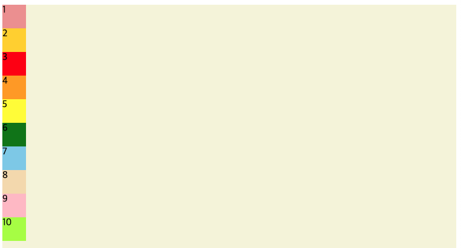

   `column-reverse`: 아래에서 위로 가는 수직 방향

   ```css
   .container {
     background: beige;
     height: 100vh;
     display: flex;
     flex-direction: column-reverse;
   }
   ```

   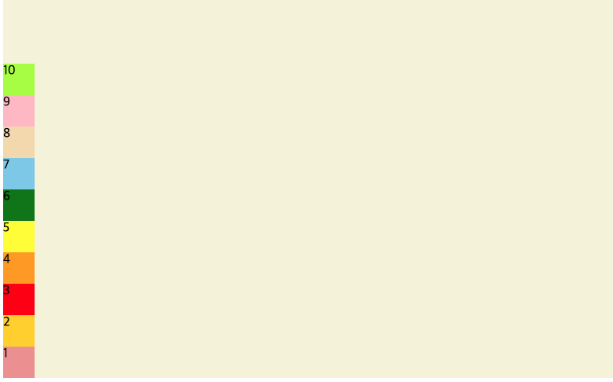

2. flex-wrap (기본 값: nowrap) - item들이 한 줄에 꽉 찼을 때 어떻게 할지의 여부(?)

   `nowrap`: 한 줄로 유지, wrapping을 안 하겠다!

   `wrap`: 꽉 차게 되면 자동적으로 item들이 다음 라인으로 이동.

   ```css
   .container {
     background: beige;
     height: 100vh;
     display: flex;
     flex-direction: column-reverse;
     flex-wrap: wrap;
   }
   ```

   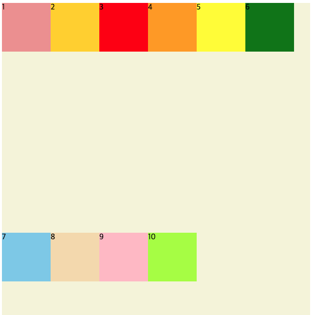

   `wrap-reverse`: 반대 방향으로 wrapping.

3. flex-flow: flex-direction과 flex-wrap을 동시에 작성(border 작성법처럼)

   ```css
   {
     flex-flow: row nowrap;
   }
   ```

4. justify-content (기본 값: flex-start): item들의 순서를 유지하면서 `중심축`을 기준으로 어떻게 배치할 것인가

   `flex-start`: 중심 축이 row일 경우 좌측 정렬, column일 경우 맨 위에서부터

   `flex-end`: 중심 축이 row일 경우 우측 정렬, column일 경우 맨 아래에서부터

   ```css
   .container {
     background: beige;
     height: 100vh;
     display: flex;
     flex-direction: row;
     flex-wrap: wrap;
     justify-content: flex-end;
   }
   ```

   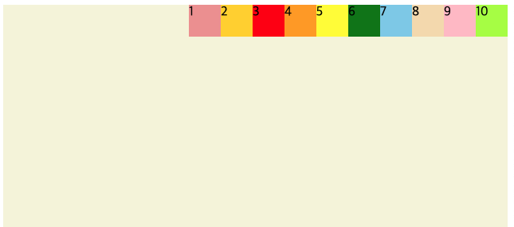

   `center`: 가운데 

   ```css
   .container {
     background: beige;
     height: 100vh;
     display: flex;
     flex-direction: row;
     flex-wrap: wrap;
     justify-content: center;
   }
   ```

   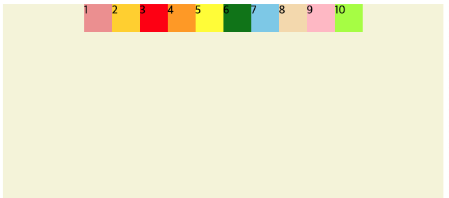

   `space-around`: item 사이에 공간 부여, 화면 경계와 요소 사이의 간격은 더 적게.

   ```css
   .container {
     background: beige;
     height: 100vh;
     display: flex;
     flex-direction: row;
     flex-wrap: wrap;
     justify-content: space-around;
   }
   ```

   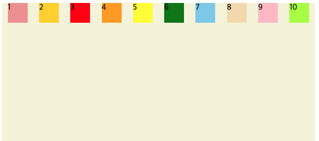

   `space-evenly`: item 사이에 공간 간격을 동일하게.

   `space-between`: item 사이에 공간을 부여하되 화면 경계와 요소 사이의 간격은 없도록.

5. align-items: item들의 순서를 유지하면서 `반대축`을 기준으로 어떻게 배치할 것인가

   `center`: 가운데

   ```css
   .container {
     background: beige;
     height: 100vh;
     display: flex;
     flex-direction: row;
     flex-wrap: wrap;
     justify-content: space-around;
     align-items: center;
   }
   ```

   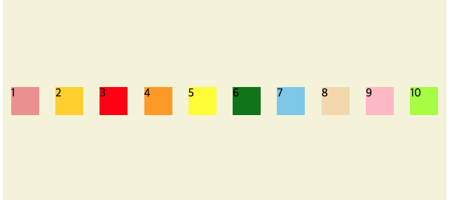

   `baseline`: 텍스트를 균등하게 item의 위치를 조정

6. align-content: 반대축의 item의 배치(algin-items와 비슷한 듯)


## 3. item 속성

1. order: item의 순서를 변경

```css
.item1 {
  order: 2
}

.item2 {
  order: 3
}

.item3 {
  order: 1
}
```

2. flex-grow (기본 값: 0): container가 작아져 item의 사이즈도 작아질 때 크기를 어느 정도(크기, 비율) 유지할지

```css
.item1 {
  background: #ef9a9a;
  flex-grow: 2;
}

.item2 {
  background: gold;
  flex-grow: 1;
}

.item3 {
  background: red;
  flex-grow: 1;
}
```

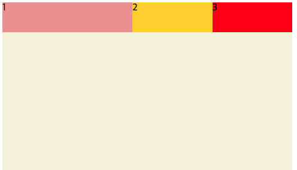

3. flex-shrink(기본 값: 0): container가 작아져 item의 사이즈도 작아질 때 크기를 어느 정도(크기, 비율) 크기를 작게 할지

   ```css
   .item1 {
     background: #ef9a9a;
     flex-shrink: 2;
   }
   
   .item2 {
     background: gold;
     flex-shrink: 1;
   }
   
   .item3 {
     background: red;
     flex-shrink: 1;
   }
   ```

4. flext-basis(기본 값: auto): flex-grow, flex-shrink 보다 좀 더 상세한 비율 명시. 넌 다른 애들보다 몇 퍼센트 크기를 유지해!

   ```css
   .item1 {
     background: #ef9a9a;
     flex-basis: 60%;
   }
   
   .item2 {
     background: gold;
     flex-basis: 30%;
   }
   
   .item3 {
     background: red;
     flex-basis: 10%;
   }
   ```

   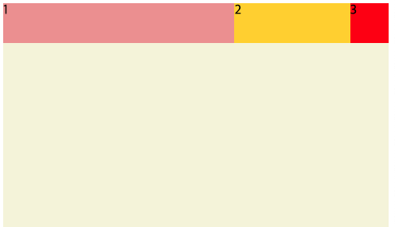

5. align-self: 아이템 개별로 정렬.

   ```css
   .item1 {
     background: #ef9a9a;
     flex-basis: 60%;
     align-self: center;
   }
   
   .item2 {
     background: gold;
     flex-basis: 30%;
   }
   
   .item3 {
     background: red;
     flex-basis: 10%;
   }
   ```

   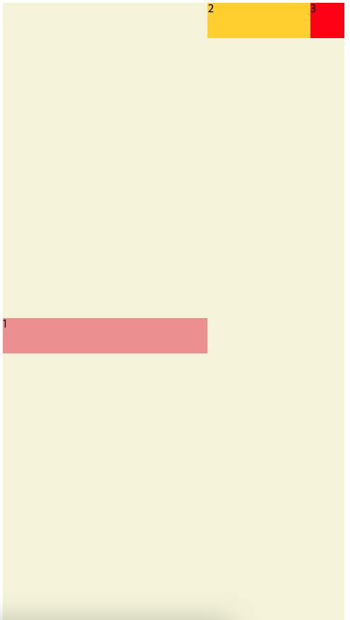


## 4. Flexbox 공부하기 좋은 사이트

[A guide to flexbox](https://css-tricks.com/snippets/css/a-guide-to-flexbox/)

[FLEXBOX FROGGY](https://flexboxfroggy.com/)

