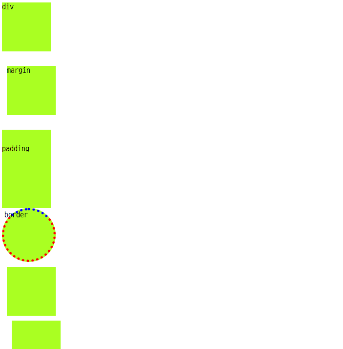

# 190730 CSS 학습 내용 정리

## 01_css.html


> 선택자1

```css
/* 태그 선택자 */
h1 {
    color: red;
}

/* 클래스 선택자 */
.blue {
    color: blue;
}

/* 아이디 선택자 */
#green {
    color: green;
}
```


> CSS 참조 방법

```css
/* css */
h1 {
    text-align: center;
}
```

```html
<!-- 외부 CSS파일 링크 link:css -->
<!-- 주로 사용되는 방식-->
<link rel="stylesheet" href="01_style.css">

<!-- CSS 내부참조(embed) 방법 (head 태그 내에 style 태그)-->
<Style>
    h1 {
        color: red;
    }
</Style>

<!-- 태그 내 적용-->
<p style="color: purple;">태그 내 적용</p>
```

- 선택자는 우선순위가 있다. 
  - `id` > `class` > `tag`
  - `!important`를 사용해 CSS 적용을 우선할 수 있으나, 사용에 주의하는 것이 바람직.


> keyword

```
(color:) (text-align:)
```


## 02_selector.html


> 선택자2

```css
/* 1. 그룹 선택자 */
h1, h2, h3, h4, h5, h6, .goldenrod {
  color: goldenrod;
}

/* 인접 선택자 */
.blue + .red + div {
  background-color: purple;
}

/* 자식 선택자 */
/* parent class 바로 밑에 있는 자식에게만 적용 */
.parent > li {
  color: red;
}

/* 후손 선택자 */
/* ancestor class 밑에 있는 자식들에 적용 */
.ancestor li {
  color: blue;
}
```

```html
<body>
  <!-- ol>li만 적용-->  
  <ol class="parent">
    <ul>
      <li>ol>ul>li</li>
    </ul>
  </ol>
  <ol class="parent">
    <li>ol>li</li>
  </ol>
  
  <!-- ol>ul>li와 ol>li 둘 다 적용-->
  <ol class="ancestor">
    <ul>
      <li>ol>ul>li</li>
    </ul>
  </ol>
  <ol class="ancestor">
    <li>ol>li</li>
  </ol>
</body>
```


> keyword

```
(height:) (width:) (background-color:) (border: 1px solid black)
```


## 03_unit.html


```css
/* rem
	root 요소의 배수
	html : 16px (브라우저 기본)
	2rem -> 32px (16 * 2)
*/
ol, ol li {
  font-size: 2rem;
}

/* em
	상위 요소의 배수
	html : 16px
	ul : 2em -> 32px
	li : 원래 ul 밑에 있어서 32px
		2em -> 32px * 2 = 64px
*/
ul, ul li {
  font-size: 2em;
}

.vw {
  font-size: 10vw;
}

.vh {
  font-size: 10vh;
}

.div-vw {
  width: 10vw;
  height: 10vw;
  background-color: rgb(95, 173, 31);
}

.div-vh {
  width: 10vh;
  height: 10vh;
  background-color: rgba(0, 0, 255, 0.9);
}
```

```html
<body>
  <h1>단위를 알아봅시다.</h1>
  <ol>
    <li>2rem</li>
  </ol>

  <ul>
    <li>2em</li>
  </ul>
    
  <!-- vw, vh -->
  <span class="vw">10vw</span><br>
  <span class="vh">10vh</span>
  <div class="div-vw"></div>
  <div class="div-vh"></div>
    
  <!-- vmin -->
  <div class="div-vmin">10vmin</div>
</body>
```


> keyword

```
(rem) (em) (vw) (vh) (vmin) (rgb) (rbga) (#dd00ff)
```


## 04_box_model.html



```css
.margin {
  margin-top: 30px;
  margin-bottom: 30px;
  margin-left: 10px;
  margin-right: 10px;
}

.padding {
  padding-top: 30px;
  padding-bottom: 30px;
}

.border {
  border-width: 5px;
  border-style: dotted;
  border-color: red;
  border-top-color: blue;
  border-radius: 50%;
}

.margin-shorthand-1 {
  /* 상하좌우 */
  margin: 10px;
}

.margin-shorthand-2 {
  /* 위아래 10px, 좌우 20px */
  margin: 10px 20px;
}

.margin-shorthand-3 {
  /* 위 10px, 좌우 20px, 아래 30px */
  margin: 10px 20px 30px;
}

.margin-shorthand-4 {
  /* 시계 방향으로 위 10px, 우 20px, 아래 30px, 좌 40px */
  margin: 10px 20px 30px 40px;
}
```


> keyword

```
(margin-top:) (margin-bottom:) (margin-left:) (margin-right:) (padding-top:) (padding-bottom:) (border-width:) (border-style:) (border-color:) (border-top-color:) (border-radius:) (margin:)
```


## 05_display.html


```css
/* 좌측 정렬 */
.ml-auto{
  margin-left: auto;
}

/* 우측 정렬 */
.mr-auto{
  margin-right: auto;
}

/* 가운데 정렬 */
.mx-auto{
  margin: 0 auto;
}

.red {
  color: red;
}
```


> keyword

```
(line-height:) (margin-left:) (margin-right:) (margin:) (block) (inline)
```


## 06_display_2.html


- `inline`: 내용없이 존재할 수 없음. (`width`, `height` 적용 x)
- `inline-block`: `block` 속성(`width`, `height`) + `inline` 속성(우측 `margin`이 사라짐
- `display: none;`: 공간 자체가 없어짐
- `visibility: hidden;`: 공간은 유지됨.


```css
.inline {
  display: inline;
}

.inline-block {
  display: inline-block;
}

.none {
  display: none;
}

.hidden{
  visibility: hidden;
}
```


> keyword

```
(display: inline) (display: inline-block) (display: none) (visibility: hidden)
```


## 07_position.html


- `absolute`는 부모 혹은 조상 요소를 기준으로 위치(*가까운 조상 중에 `static`이 아닌 요소*) 부모가 static이어 absolute1이 body를 기준으로 위치함.
- `relative`는 자기가 원래 있어야할 위치(static)를 기준으로 이동!
- `fixed`는 브라우저 위치에 따라 변경!


```css
.parent {
  background-color: red;
}

.absolute {
  position: absolute;
  top: 50px;
  left: 50px;
}

.relative { /* static에서 relative로 변경(?) */
  position: relative;
}

.relative-move {
  position: relative;
  top: 30px;
  left: 30px;
}

.fixed {
  position: fixed;
  width: 100%;
  bottom: 0;
  left: 0;
}

body {
  height: 10000px;
}
```

- 자세한 사항은 코드 참조 
- [07_position.html로 이동하기](https://github.com/yeomkyeorae/TIL/blob/master/web/CSS/07_position.html) 
- [07_style.css로 이동하기](https://github.com/yeomkyeorae/TIL/blob/master/web/CSS/07_style.css)


> keyword

```
(position: absolute) (position: relative) (position: fixed) (width:) (height:) (top:)(bottom:) (left:) (right:)
```


## box.html


- 07_position.html 응용
- [box.html](https://github.com/yeomkyeorae/TIL/blob/master/web/CSS/box.html)
- [box_style.css](https://github.com/yeomkyeorae/TIL/blob/master/web/CSS/box_style.css)


## 08. float.html


`구름`처럼 둥둥 떠다닌다고 생각하자!

```css
.float-left {
  float: left;
}

.float-right {
  float: right;
}

.back {
  background-color: orange;
  width: 300px;
}
```


> keyword

```
(float: left) (float: right)
```

